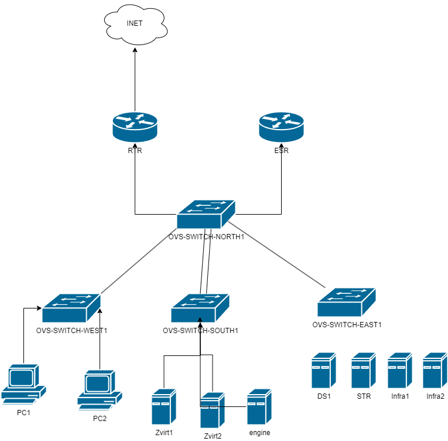

Итак, суть задания. Пересказ вольный.

1) Устройства выходят в интернет через машину RTR - это Astra Linux

2) SWITCH - это всё OpenvSwitch, тачки клиентов - отдельный влан 101. Тачки Zvirt - влан 102, тачки развернутые в будущем в Zvirt - влан 201, тачки инфраструктуры - 103 VLAN

3) Агрегрирование каналов обычный LACP

4) На машинах Infra развертываются все сервисы компании -   DHCP, DNS, NTP в режиме отказоустойчивойсти. Общая идея - все должно жить при отключении одного из хоста

5) DS1 и DS2 - FreeIPA, ничего интересного. Один мейн сервер другой обычная реплика. 

6) Все машины PC1 и PC2 в домене

7) В самом домене пользоваетели - Vasya Petya Kolya - они не нужны в задании ровно никогда были, просто висят пользаки

8) Машина STR - играет роль сервера хранения. У неё два диска по 100 ГБ. Объединяем их в ЛВМ. Первая лвм группа называется VMNFS - это лвм Striped, её монтируй в папку /mnt/nfs и делай NFS-сервер для хранения там в будущем дисков вмков в звирте.
Вторая группа - VMSCSI - это лвм Mirror объем около 50 гб (зеркало жеж), этот лвм том надо будет по скази отдавать звирту

9) Сам звирт - Машина engine - это standalone engine НОДа для звирта, с неё все управляется

10) Два других - обычные хосты виртуализации

11) В Zvirt надо добавить VMNFS и VMSCSI стораджи, собрать два разных кластера в одном датацентре. В каждый кластер влезет по одному хосту. Разделение на кластеры нужно для того чтобы организовать разные SDN. В одном кластере SDN провайдер у тебя обычный линукс бридж.

Во втором кластере - провайдер это OpenvSwitch

12) В звирте надо сделать темплейт дебиана, из него развернуть три виртуалки

1 виртуалка родится в одном кластере где bridge провайдер SDN, адрес летит по DHCP от твоего сервера на Infra1 или Infra2. 

2 Виртуалка родится в OVS SDN твоего звирт, сеть должна называться Left - 192.168.100.0\24

3 Виртуалка родится в OVS SDN твоего звирт, но уже другая сеть Right - 192.168.200.0/24

Надо чтобы все виртуалки выходили в интернет через свой SDN а также пинговали друг друга

The end
